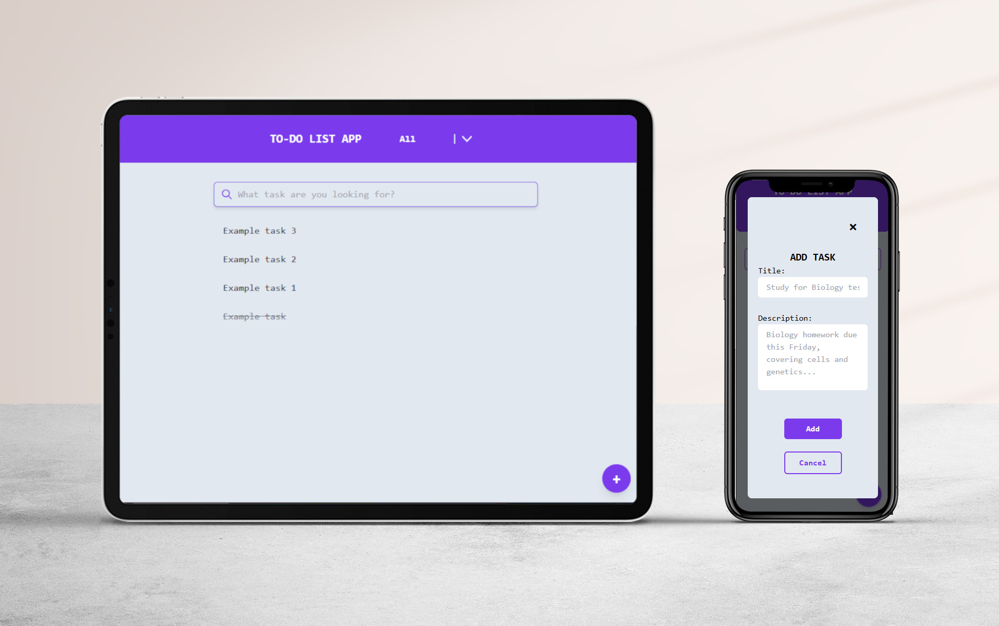

# 📋 Organizador de tareas




Aplicación web para gestionar tareas desarrollada con React, Tailwind CSS, y Express.js. Implementa un sistema CRUD completo (Crear, Leer, Actualizar, Eliminar) para tareas, a través de una API RESTful.

  <div align="center">
    <a href="https://youtu.be/IfuqzD6UAe8" target="_blank">
      
    </a>
    <a href="https://app-to-do-list-theta.vercel.app/" target="_blank">
      
    </a>
  </div>  
  <br>

  📚 Cosas que aprendí
  - Basicos de Node.js: Me familiaricé con su entorno y cómo empezar a usarlo.
  - Conceptos básicos de Backend: Entendí qué es el backend y cómo se organiza un proyecto desde cero.
  - Express.js: Di mis primeros pasos creando rutas y servidores simples.
  - APIs: Aprendí a crear mi primera API y manejar distintos tipos de peticiones.
  - Tailwind CSS: Empecé a estilar interfaces usando clases utilitarias de Tailwind.
---

## 📁 Estructura del Proyecto

```
app-to-list/
├── 📁 frontend/                 # Aplicación de React + Vite
│   ├── 📁 src/
│   │   ├── 📁 components/       # Componentes de React
│   │   ├── 📁 config/           # Ajustes y constantes
│   │   ├── 📁 contexts/         # Contextos de React
│   │   ├── 📁 hooks/            # Customs Hooks de React
│   │   ├── 📁 logic/            # Lógica de negocio
│   │   ├── 📁 pages/            # Páginas para Enrutamiento
│   │   ├── 📁 services/         # Servicios de datos
│   │   ├── app.jsx 
│   │   └── main.jsx 
│   └── package.json
├── 📁 backend/                  # API de Express
│   ├── index.js                 # Punto de entrada
│   └── package.json
├── 📁 readme/                   # Imagenes del proyecto
└── README.md
```

---

## 🚀 Instalación

### Requisitos previos
- Node.js 18+ 
- npm or yarn

### 1. Clonar este repositorio
```bash
git clone https://github.com/AlexRubenPumari/app-to-do-list.git
cd app-to-list
```

### 2. Instalar dependencias de Backend
```bash
cd backend
npm install
```

### 3. Instalar dependencias de Frontend
```bash
cd ../frontend
npm install
```

---

## 🚀 Ejecutando la app

### Inicializar el Backend
```bash
cd backend
node index.js
```
Se puede indicar puerto para ejecutar servidor, en la raíz de la carpeta `backend` con un archivo `.env`, que contenga algo similar a:
```bash
PORT=4000
```
En caso contrario, el servidor se aloja por defecto en: `http://localhost:3000` 

### Inicializar el Frontend
```bash
cd frontend
npm run dev
```
El servidor se aloja por defecto en: `http://localhost:5137`

---

## 🔧 Back-End

🖥️ Back-End alojado en Render: [backend-app-to-do-list](https://app-to-do-list.onrender.com/api/tasks)  

### Endpoints de API

| Método   | Endpoint           | Descripción                         |
|----------|--------------------|-------------------------------------|
| `GET`    | `/api/tasks`       | Obtener todas las tareas            |
| `GET`    | `/api/tasks/:id`   | Obtener una tarea por su ID         |
| `POST`   | `/api/tasks`       | Crear una nueva tarea               |
| `PUT`    | `/api/tasks/:id`   | Actualizar una tarea existente      |
| `DELETE` | `/api/tasks/:id`   | Eliminar una tarea por su ID        |