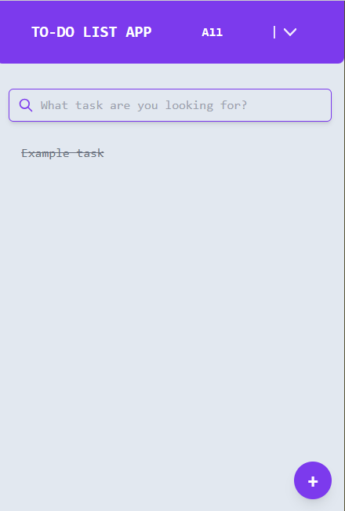
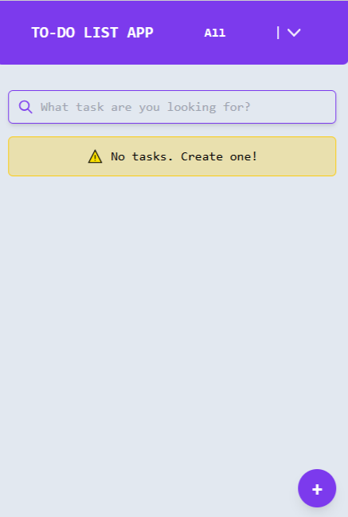
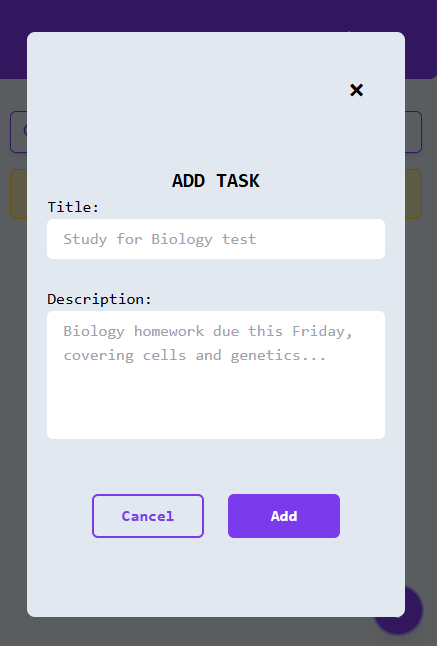
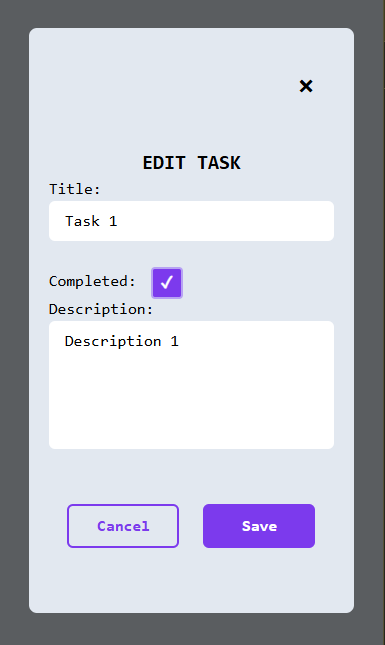

# PASOS NECESARIOS
En pocas palabras, iniciar el servidor Express y luego el servidor de Vite.
## Requisitos Previos
Node.js y npm

## Servidor Express
Navega al directorio del backend desde la raíz del repositorio:

```
cd backend
npm i
node index.js
````

> Nota: Puedes crear un archivo .env en el directorio `backend` para personalizar el puerto en el que se ejecuta el servidor. Ejemplo de contenido de `.env`:

```
PORT=4000

```

## Servidor Vite
En una nueva ventana de terminal, navega al directorio de `frontend` desde la raíz del repositorio y ejecutar:

```
cd frontend
npm i
npm run dev
```

## Acceso a la Aplicación
Una vez que ambos servidores (backend y frontend) estén en funcionamiento, abre tu navegador web y ve a: `http://localhost:5173`
> Nota: El puerto 5173 es el predeterminado para el servidor de desarrollo de Vite. Si tienes algún problema, revisa tu consola para ver el número de puerto correcto.







